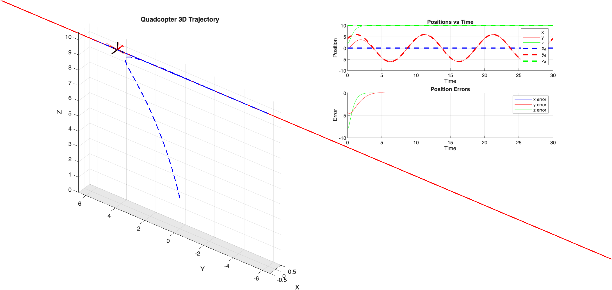
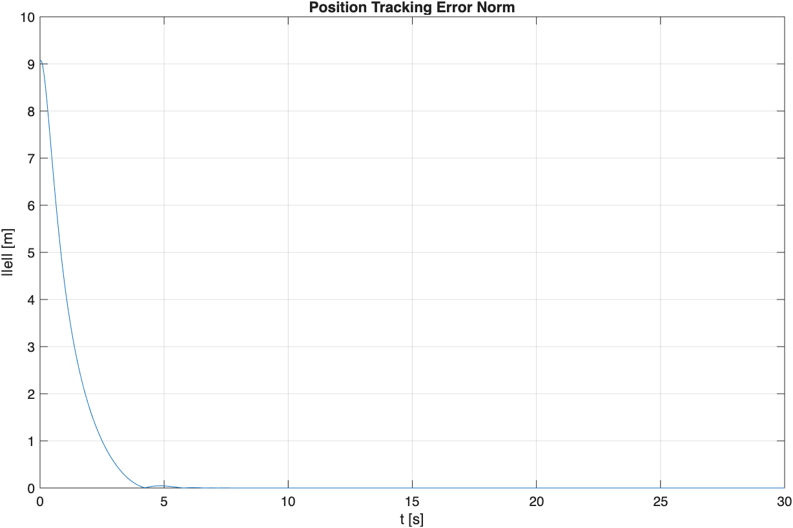
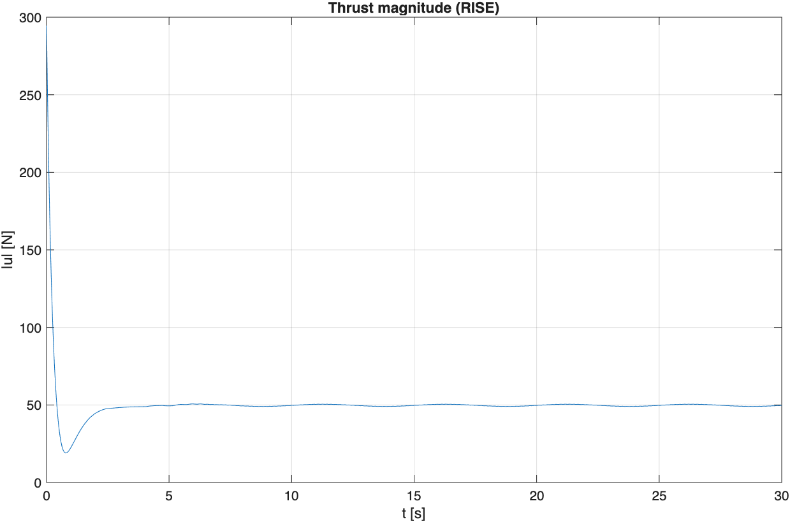
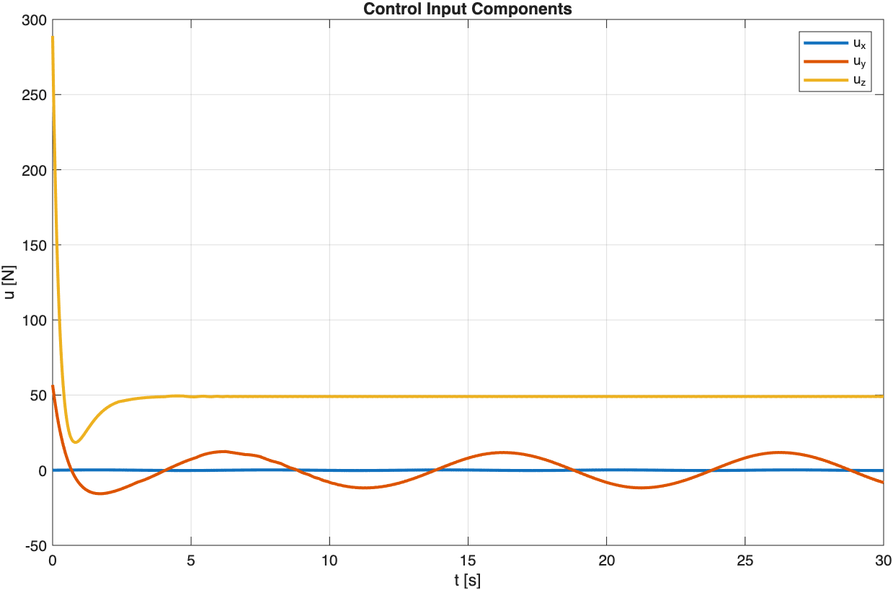

# Homework 03
Trajectory tracking with robust integral of the sign of error (RISE) control.

- `hw31_main.m`: RISE translation control with an added disturbance

## Homework 3-1 RISE tracking 

### Run

From the repository root in MATLAB:

```matlab
addpath(fullfile(pwd, 'common'), fullfile(pwd, 'Hw03'))
hw31_main
```
### Results

Trajectory.



Tracking error.



Thrust magnitude.



Thrust components.



---

## Homework 3-2 Translate + Attitude Control

TO ADD. 